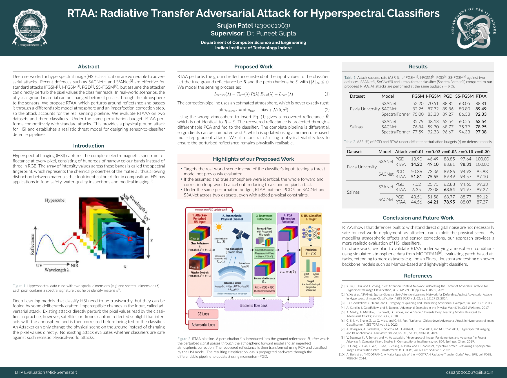
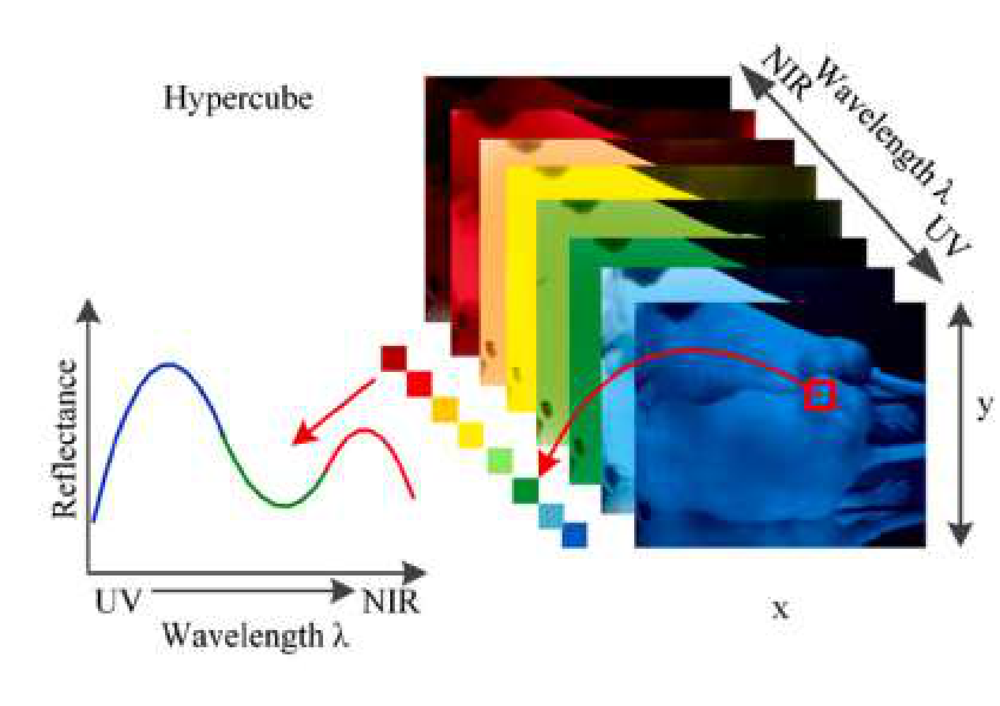
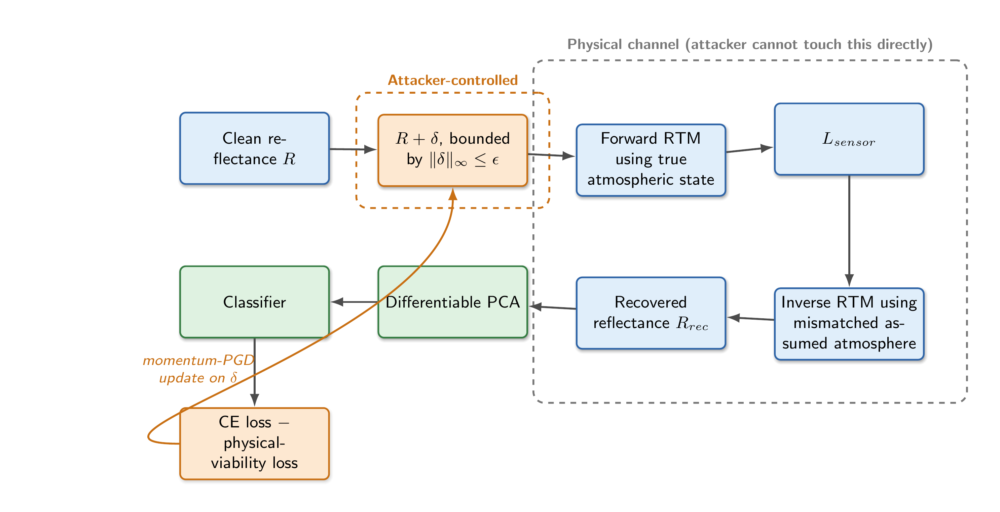

<div align="center">

# RTAA: Radiative Transfer Adversarial Attack for Hyperspectral Classifiers

**A Physics-Grounded Adversarial Threat Model for Remote Sensing Pipelines**

[](https://www.python.org/)
[](https://pytorch.org/)
[](https://www.iiti.ac.in/)
[]()
[](LICENSE)

**Author:** [Srujan Patel](mailto:cse230001063@iiti.ac.in) (230001063)  
**Supervisor:** [Dr. Puneet Gupta](https://www.iiti.ac.in/)  
*Department of Computer Science and Engineering, Indian Institute of Technology Indore*

---

[**[Project Poster (PDF)]**](assets/rtaa_btp_poster.pdf) &nbsp;•&nbsp; [**[Full Poster (HD Image)]**](assets/rtaa_btp_poster.png) &nbsp;•&nbsp; [**[Methodology](#-methodology)**] &nbsp;•&nbsp; [**[Experimental Results](#-experimental-results)**] &nbsp;•&nbsp; [**[Quickstart](#-quickstart)**]

---

</div>

## 📌 Project Overview Poster

<div align="center">
  <a href="assets/rtaa_btp_poster.png">
    
  </a>
  <p><em>Figure 0: Academic Presentation Poster presented for the BTP Mid-Semester Evaluation at IIT Indore. Click on the poster to view the ultra high-resolution render, or download the <a href="assets/rtaa_btp_poster.pdf">PDF version here</a>.</em></p>
</div>

---

## 📖 Executive Summary

Deep learning models for **Hyperspectral Image (HSI)** classification are known to be vulnerable to adversarial attacks. Existing defense architectures—such as **SACNet** (*Xu et al., IEEE TIP 2021*) and **S3ANet** (*Xu et al., IEEE TGRS 2024*)—demonstrate robustness against conventional digital attacks like **FGSM**, **I-FGSM**, **PGD**, and **SS-FGSM**.

However, **all existing attacks assume the adversary can directly modify the digital pixel values read by the classifier**.

In realistic remote sensing (airborne or spaceborne observation):
1. **Physical Surface Constraint:** An attacker on the ground can only alter physical surface properties (e.g., camouflage material, paints, or optical coatings).
2. **Atmospheric Channel:** Ground-reflected solar irradiance travels through the atmospheric column, undergoing attenuation (transmittance $T_{\text{atm}}$) and additive scattering (path radiance $L_{\text{path}}$) before arriving at the sensor.
3. **Atmospheric Correction:** Raw at-sensor radiance is converted back into surface reflectance via operational atmospheric compensation algorithms (e.g., FLAASH, QUAC).
4. **Retrieval Mismatch:** Atmospheric parameter retrieval is never exact ($\mathbf{s}_{\text{assumed}} \neq \mathbf{s}_{\text{true}}$), introducing systematic scaling and spectral distortion.

**RTAA (Radiative Transfer Adversarial Attack)** is the first attack framework that explicitly perturbs ground surface reflectance and backpropagates classification gradients through a **differentiable atmospheric radiative transfer surrogate** and an **imperfect atmospheric compensation step**. Under identical perturbation budgets, RTAA matches or exceeds digital PGD attacks while strictly satisfying physical viability constraints (non-negativity and 2nd-order spectral smoothness).

---

## 🔬 Background: Hyperspectral Imaging (HSI)

<p align="center">
  
  <br />
  <em>Figure 1: Hyperspectral data cube with spatial dimensions $(x, y)$ and continuous spectral dimension $(\lambda)$. Each pixel represents a continuous spectral signature ("fingerprint") characteristic of surface chemical composition.</em>
</p>

Hyperspectral sensors collect hundreds of contiguous, narrow spectral bands across visible and near-infrared (VNIR) and short-wave infrared (SWIR) wavelengths. This granular spectral signature enables fine-grained material identification in critical domains including:
- Defense, target tracking, and camouflage detection
- Environmental monitoring and water quality inspection
- Precision agriculture and mineral exploration

Existing adversarial attacks perturb digital pixel values without considering physical optical laws, generating perturbations with negative reflectance or high-frequency spectral oscillations that are physically impossible to realize with real materials.

---

## ⚙️ Methodology & Architecture

<p align="center">
  
  <br />
  <em>Figure 2: The complete RTAA pipeline. A physical material perturbation $\delta$ is applied to ground surface reflectance $R$. The signal is propagated through an atmospheric forward model, an imperfect atmospheric compensation stage, and differentiable dimensionality reduction/feature embedding into the HSI classifier. Momentum-PGD updates $\delta$ via end-to-end backpropagation.</em>
</p>

### 1. Mathematical Formulation

#### A. Physical Surface Perturbation
Let $R \in [0, 1]^B$ denote clean ground surface reflectance across $B$ spectral bands. The adversary optimizes an additive perturbation $\delta$ constrained by an $L_\infty$ budget:
$$R_{\text{adv}} = \text{clamp}(R + \delta, \; 0.0, \; 1.0), \quad \|\delta\|_\infty \le \epsilon$$

#### B. Forward Radiative Transfer Model
Sunlight passes through the atmospheric column, reflects off the surface, and reaches the airborne/satellite sensor as **at-sensor radiance** $L_{\text{sensor}}$:
$$L_{\text{sensor}}(\lambda) = T_{\text{atm}}^{\text{true}}(\lambda) \cdot R_{\text{adv}}(\lambda) \cdot E_{\text{sun}}(\lambda) + L_{\text{path}}^{\text{true}}(\lambda)$$
where:
- $E_{\text{sun}}(\lambda)$ is the exo-atmospheric solar spectral irradiance.
- $T_{\text{atm}}^{\text{true}}(\lambda) \in [0, 1]$ is the two-way atmospheric transmittance.
- $L_{\text{path}}^{\text{true}}(\lambda) \ge 0$ is the atmospheric path radiance (Rayleigh + aerosol scattering).

#### C. Differentiable RTM Surrogate (`RTMSurrogate`)
To permit gradient backpropagation, RTAA replaces non-differentiable numerical codes (e.g., MODTRAN, 6S) with a neural surrogate emulator mapping atmospheric state $\mathbf{s}_{\text{atm}} = [\tau_{550}, W, \theta_s]$ (aerosol optical depth, column water vapor, solar zenith angle) to $(T_{\text{atm}}, L_{\text{path}})$ using sigmoid and softplus activations.

#### D. Imperfect Atmospheric Correction & Retrieval Mismatch
Operational atmospheric compensation cannot observe true atmosphere directly and introduces retrieval error:
$$\mathbf{s}_{\text{assumed}} = \mathbf{s}_{\text{true}} + \mathbf{b}_{\text{bias}} + \mathcal{N}(0, \sigma^2)$$
Recovered surface reflectance $\hat{R}$ is obtained via closed-form differentiable inversion:
$$\hat{R}(\lambda) = \frac{L_{\text{sensor}}(\lambda) - L_{\text{path}}^{\text{assumed}}(\lambda)}{T_{\text{atm}}^{\text{assumed}}(\lambda) \cdot E_{\text{sun}}(\lambda) + \epsilon}$$

> **Key Theoretical Insight:** If $\mathbf{s}_{\text{assumed}} \equiv \mathbf{s}_{\text{true}}$, the forward and inversion stages cancel out mathematically to an exact identity ($\hat{R} \equiv R_{\text{adv}}$), reducing to a conventional digital attack. Modeling this retrieval mismatch forces $\delta$ to be robust against realistic atmospheric inversion artifacts.

#### E. Physical Viability Regularization
To ensure the perturbed spectrum $R_{\text{adv}}$ corresponds to physical materials, RTAA introduces a two-term physical penalty:
$$\mathcal{L}_{\text{phys}} = w_{\text{neg}} \cdot \mathbb{E}\left[\text{ReLU}(-R_{\text{adv}})^2\right] + w_{\text{smooth}} \cdot \mathbb{E}\left[\left(R_{\text{adv}}[\lambda+2] - 2R_{\text{adv}}[\lambda+1] + R_{\text{adv}}[\lambda]\right)^2\right]$$
The discrete second-order difference suppresses jagged, non-physical high-frequency spectral spikes.

#### F. Composite Objective & Momentum-PGD
The attack optimizes the joint objective:
$$\mathcal{L}_{\text{total}} = w_{\text{adv}} \cdot \mathcal{L}_{\text{CE}}(f(\hat{R}), y) - \mathcal{L}_{\text{phys}}$$
Using momentum-accumulated normalized gradients:
$$g_t = \nabla_{\delta} \mathcal{L}_{\text{total}}, \quad g_t' = \frac{g_t}{\text{mean}(|g_t|) + 10^{-12}}$$
$$v_t = \mu \cdot v_{t-1} + g_t' \quad (\mu = 0.9)$$
$$\delta_{t+1} = \Pi_{[-\epsilon, \epsilon]} \left(\delta_t + \alpha \cdot \text{sign}(v_t)\right)$$

---

## 📊 Experimental Results

We evaluate RTAA against **5 baseline attacks** across **2 benchmark datasets** (Pavia University, Salinas) and **3 representative target models**:
- **S3ANet** (*Spatial-Spectral Self-Attention Learning Network for Defending Against Adversarial Attacks, IEEE TGRS 2024*)
- **SACNet** (*Self-Attention Context Network, IEEE TIP 2021*)
- **SpectralFormer** (*Transformer-based Hyperspectral Classifier, IEEE TGRS 2022*)

### Table 1: Attack Success Rate (ASR %) at Perturbation Budget $\epsilon = 0.05$

| Dataset | Target Model | FGSM | I-FGSM | PGD | SS-FGSM | **RTAA (Ours)** |
| :--- | :--- | :---: | :---: | :---: | :---: | :---: |
| **Pavia University**<br>*(103 bands, 9 classes)* | **S3ANet** | 52.20% | 70.51% | 88.85% | 63.05% | **88.81%** |
| | **SACNet** | 82.25% | 87.32% | 89.86% | 80.80% | **89.49%** |
| | **SpectralFormer** | 75.00% | 85.33% | 89.27% | 86.33% | **92.33%** |
| **Salinas**<br>*(204 bands, 16 classes)* | **S3ANet** | 35.79% | 38.13% | 62.54% | 60.55% | **63.54%** |
| | **SACNet** | 76.84% | 59.30% | 68.77% | 75.79% | **78.95%** |
| | **SpectralFormer** | 77.59% | 92.33% | 96.67% | 94.33% | **97.08%** |

---

### Table 2: ASR (%) Under Varying Perturbation Budgets ($\epsilon$)

| Dataset | Target Model | Attack | $\epsilon = 0.01$ | $\epsilon = 0.02$ | $\epsilon = 0.05$ | $\epsilon = 0.10$ | $\epsilon = 0.20$ |
| :--- | :--- | :--- | :---: | :---: | :---: | :---: | :---: |
| **Pavia University** | **S3ANet** | PGD | 13.90% | 46.49% | 88.85% | 97.64% | 100.00% |
| | | **RTAA** | **14.20%** | **49.10%** | **88.81%** | **98.31%** | **100.00%** |
| | **SACNet** | PGD | 50.36% | 73.36% | 89.86% | 94.93% | 95.93% |
| | | **RTAA** | **51.81%** | **75.55%** | **89.49%** | **94.57%** | **97.10%** |
| **Salinas** | **S3ANet** | PGD | 7.02% | 25.75% | 62.88% | 94.65% | 99.33% |
| | | **RTAA** | 6.35% | 23.08% | **63.54%** | 91.97% | **99.27%** |
| | **SACNet** | PGD | 43.51% | 51.58% | 68.77% | 88.77% | 89.12% |
| | | **RTAA** | **44.56%** | **64.21%** | **78.95%** | 88.07% | 87.37% |

---

## 📂 Repository Structure

```plaintext
RTAA/
├── assets/                               # Presentation poster & methodology diagrams
│   ├── rtaa_btp_poster.pdf               # Original vector academic poster
│   ├── rtaa_btp_poster.png               # Ultra HD render of the poster
│   ├── rtaa_poster_preview.png           # Web-optimized poster preview
│   ├── rtaa_pipeline_diagram.png         # End-to-end RTAA architecture diagram
│   └── hyperspectral_cube.png            # HSI data cube schematic
├── notebooks/                            # Reproducible evaluation notebooks
│   ├── adversarial_benchmark_colab.ipynb # Google Colab benchmark notebook
│   └── adversarial_benchmark_kaggle.ipynb# Kaggle GPU benchmark notebook
├── src/rtaa/                             # Core framework package
│   ├── attacks/                          # Attack implementations
│   │   ├── rtaa_attack.py                # Core RTAA Momentum-PGD generator
│   │   ├── sacnet_attack.py              # Whole-scene FCN attack adapter
│   │   ├── spectralformer_attack.py      # Vision Transformer attack adapter
│   │   └── baselines.py                  # FGSM, I-FGSM, PGD, SS-FGSM implementations
│   ├── rtm/                              # Radiative transfer modeling
│   │   ├── forward_model.py              # Differentiable sensor radiance & inversion
│   │   ├── mismatch.py                   # Atmospheric compensation mismatch models
│   │   ├── surrogate.py                  # Differentiable neural RTM surrogate
│   │   └── placeholder_physics.py        # Atmospheric parameter generation
│   ├── models/                           # HSI classifier backbones
│   │   ├── hybridsn.py                   # HybridSN 3D-2D CNN
│   │   ├── sacnet.py                     # SACNet interface
│   │   ├── s3anet.py                     # S3ANet interface
│   │   ├── spectralformer.py             # SpectralFormer interface
│   │   └── mambahsi.py                   # Mamba State-Space Model interface
│   └── eval/                             # Evaluation & reporting
│       ├── metrics.py                    # OA, AA, Kappa, SAM, SID, PCR, ASR
│       └── excel_writer.py               # Formatted benchmark table exporter
├── generate_notebook.py                  # Automated notebook generation script
├── setup.py                              # Package installation configuration
└── README.md                             # Project documentation
```

---

## 🚀 Quickstart

### 1. Installation

```bash
# Clone the repository
git clone -b RTAA https://github.com/SRUJANPATEL3669/S3ANET.git
cd S3ANET

# Install dependencies
pip install -r requirements_colab.txt
pip install -e .
```

### 2. Basic Usage in PyTorch

```python
import torch
from rtaa.attacks.rtaa_attack import RTAAAttack, DifferentiablePCA
from rtaa.rtm.surrogate import RTMSurrogate
from rtaa.rtm.mismatch import AtmosphericMismatchConfig

device = torch.device("cuda" if torch.cuda.is_available() else "cpu")

# Initialize RTM surrogate and attack
n_bands = 103  # e.g., Pavia University
surrogate = RTMSurrogate(n_bands=n_bands).to(device)
solar_irradiance = torch.ones(n_bands, device=device)

attack = RTAAAttack(
    surrogate=surrogate,
    solar_irradiance=solar_irradiance,
    epsilon=0.05,
    step_size=0.01,
    n_steps=20,
    momentum=0.9,
    mismatch_config=AtmosphericMismatchConfig()  # Realistic retrieval error
)

# Run attack on reflectance patches
# adv_spectra, step_logs = attack.generate(classifier, pca_projector, clean_spectra, ...)
```

---

## 🎓 Academic Credit & Supervision

This research was conducted as part of the **BTech Project (BTP)** in the **Department of Computer Science and Engineering** at the **Indian Institute of Technology Indore (IIT Indore)**.

- **Student Researcher:** Srujan Patel ([cse230001063@iiti.ac.in](mailto:cse230001063@iiti.ac.in))
- **Faculty Supervisor:** Dr. Puneet Gupta ([Department of CSE, IIT Indore](https://www.iiti.ac.in/))

---

## 📚 Key References

1. **SACNet:** Y. Xu, B. Du, and L. Zhang, *"Self-Attention Context Network: Addressing the Threat of Adversarial Attacks for Hyperspectral Image Classification,"* **IEEE Transactions on Image Processing (TIP)**, vol. 30, pp. 8671–8685, 2021.
2. **S3ANet:** Y. Xu et al., *"S³ANet: Spatial–Spectral Self-Attention Learning Network for Defending Against Adversarial Attacks in Hyperspectral Image Classification,"* **IEEE Transactions on Geoscience and Remote Sensing (TGRS)**, vol. 62, 2024.
3. **FGSM:** I. J. Goodfellow, J. Shlens, and C. Szegedy, *"Explaining and Harnessing Adversarial Examples,"* in **Proc. ICLR**, 2015.
4. **Physical Adversarial Examples:** A. Kurakin, I. Goodfellow, and S. Bengio, *"Adversarial Examples in the Physical World,"* in **ICLR Workshop**, 2017.
5. **PGD:** A. Madry, A. Makelov, L. Schmidt, D. Tsipras, and A. Vladu, *"Towards Deep Learning Models Resistant to Adversarial Attacks,"* in **Proc. ICLR**, 2018.
6. **SS-FGSM:** C. Shi, M. Zhang, Z. Lv, Q. Miao, and C.-M. Pun, *"Universal Object-Level Adversarial Attack in Hyperspectral Image Classification,"* **IEEE TGRS**, vol. 61, 2023.
7. **SpectralFormer:** D. Hong, Z. Han, J. Yao, L. Gao, B. Zhang, A. Plaza, and J. Chanussot, *"SpectralFormer: Rethinking Hyperspectral Image Classification With Transformers,"* **IEEE TGRS**, vol. 60, 2022.
8. **MODTRAN6:** A. Berk et al., *"MODTRAN6: A Major Upgrade of the MODTRAN Radiative Transfer Code,"* **Proc. SPIE**, vol. 9088, 2014.
